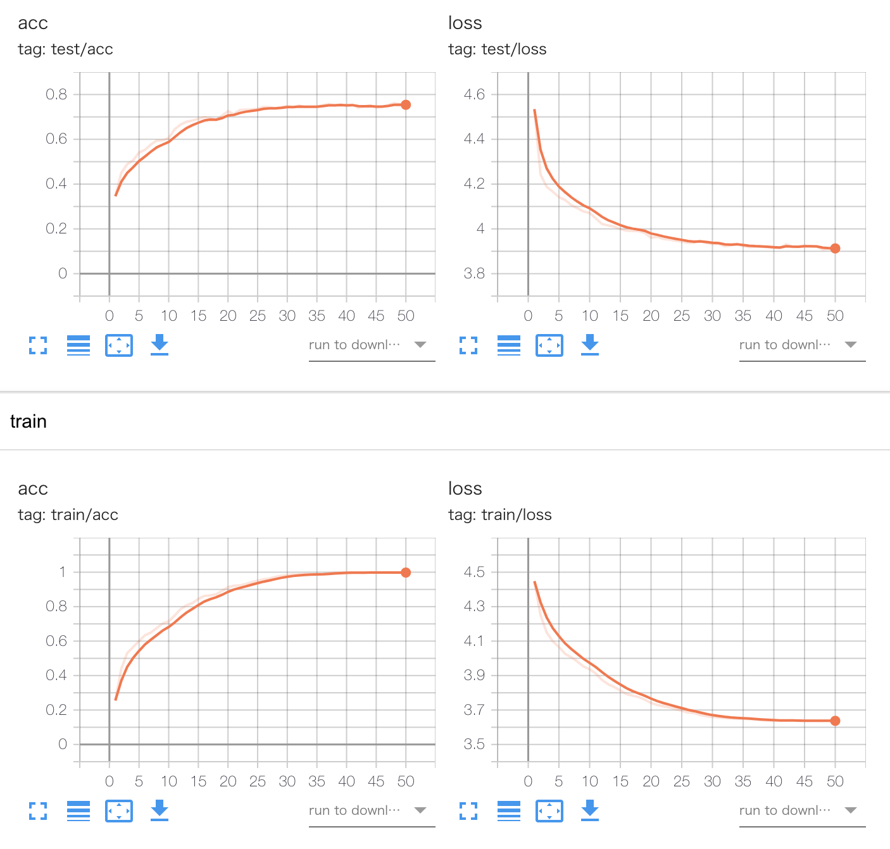

# Action Recognition in CNN-LSTM

This repository is a tutorial on the CNN-LSTM model of Action recognition using the UCF101 dataset. This is a refactored repository of [eriklindernoren/Action-Recognition](https://github.com/eriklindernoren/Action-Recognition). I'm glad if you can use it as a reference.

## :gift: Dataset

Details of UCF101 can be found at the following link. [UCF101 - Action Recognition Data Set](https://www.crcv.ucf.edu/data/UCF101.php).

## :whale: Instalation

I run in the following environment. If you have a similar environment, you can prepare the environment immediately with pipenv.

* Ubuntu 20.04.1 LTS
* CUDA Version 11.0
* Python 3.8.5

```
$ pip install pipenv
$ pipenv sync
```

If you do not have a cuda environment, please use Docker. Build docker with the following command.

```
$ docker-compose up -d dev
```

Run docker with the following command.

```
$ docker run --rm -it --runtime=nvidia \
      -v /mnt/:/mnt \
      -v /home/kuroyanagi/clones/Action-Recognition-CNN-LSTM/:/work/Action-Recognition-CNN-LSTM \
      -u (id -u):(id -g) \
      -e HOSTNAME=(hostname) \
      -e HOME=/home/docker \
      --workdir /work/Action-Recognition-CNN-LSTM \
      --ipc host \
      ubuntu20-cuda11-py38 bash
```

## :gift: Prepare dataset

```
$ cd data/
$ bash download_ucf101.sh # Downloads the UCF-101 dataset (~7.2 GB)
$ python extract_frames.py # Extracts frames from the video (~26.2 GB)
```

## :writing_hand: CNN-LSTM

The original repository defined the model as ConvLSTM, but it was renamed because CNNLSTM is correct.

What is the difference between ConvLSTM and CNN LSTM? - Quora https://www.quora.com/What-is-the-difference-between-ConvLSTM-and-CNN-LSTM

## :runner: Train

`train.py` performs training/validation according to the specified config. A checkpoint for each epoch is saved and evaluated for validation.

To execute the experiment of `configs/experiments/train_exp01.yaml`, execute as follows. Specify the output destination as `hydra.run.dir=outputs/train/exp01`.

```
$ pipenv run python train.py +experiments=train_exp01 hydra.run.dir=outputs/train/exp01
```

If you use Docker, execute the following command.

```
$ export TORCH_HOME=/home/docker
$ python train.py +experiments=train_exp01 hydra.run.dir=outputs/train/exp01
```

## :standing_person: Test

`test.py` performs only inference for a checkpoint. The specifications of config and output are the same as train.

```
$ pipenv run python test.py +experiments=test_exp01 hydra.run.dir=outputs/test/exp01
```

## :movie_camera: Test on Video

`test_on_video.py` makes inferences for a video.

```
$ pipenv run python test_on_video.py +experiments=test_on_video_exp01 hydra.run.dir=outputs/test_on_video/exp01
```

<p align="center">
    
</p>

## :chart_with_upwards_trend: Results

The results of TensorBoard in split 1 are as follows.



## :traffic_light: Hydra color log

This repository also sets up a beautiful hydra color log.

<p align="center">
    
</p>

## :closed_book: References

* [eriklindernoren/Action-Recognition](https://github.com/eriklindernoren/Action-Recognition)
* CNN–LSTM Architecture for Action Recognition in Videos http://170.210.201.137/pdfs/saiv/SAIV-02.pdf
* What is the difference between ConvLSTM and CNN LSTM? - Quora https://www.quora.com/What-is-the-difference-between-ConvLSTM-and-CNN-LSTM


## :rocket: TODOs

- [x] fix bug of original repository
- [x] Docker and pipenv
- [x] check code format with black, isort, vulture
- [x] hydra and color logger
- [x] TensorBoard
- [] PyTorch Lightning and wandb
